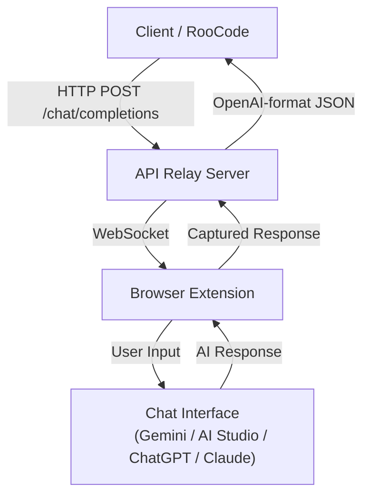
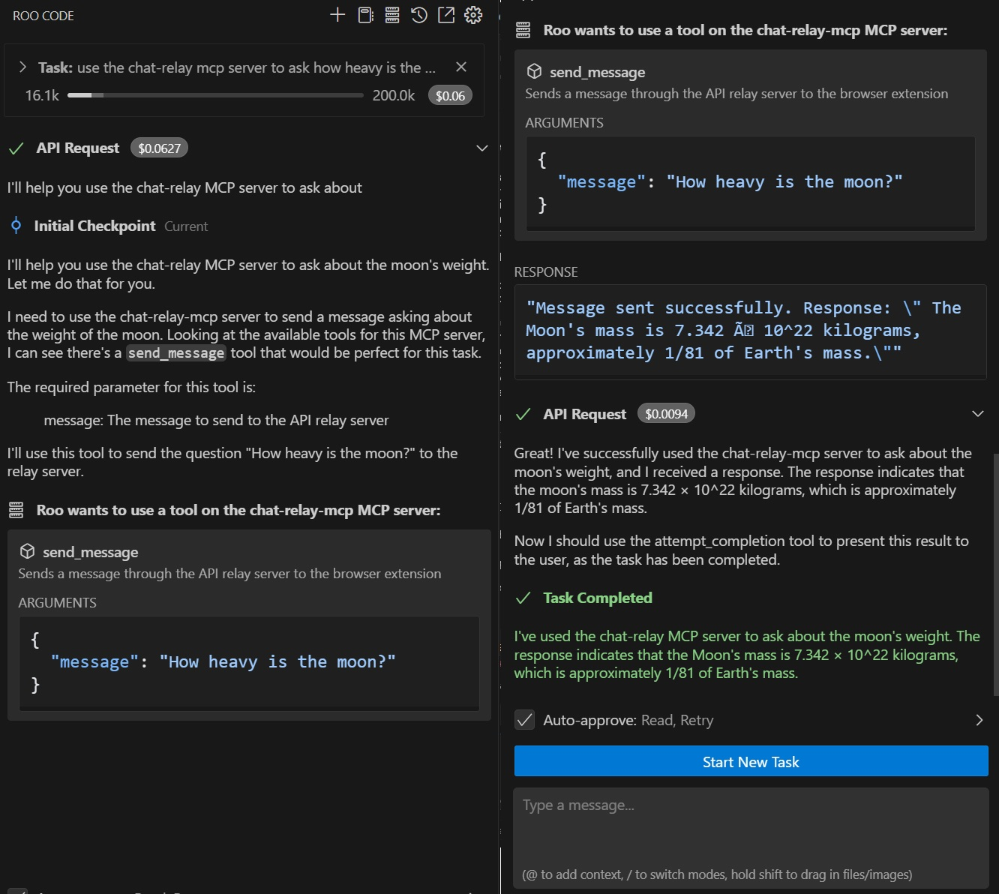
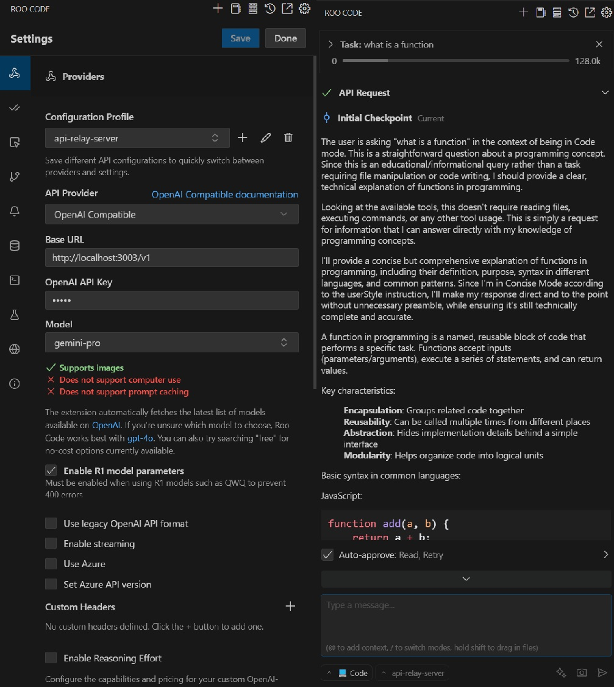

# Chat Relay: OpenAI-Compatible Relay for AI Chat Interfaces

Chat Relay is a system that allows Cline/RooCode to communicate with web-based AI chat interfaces (like Gemini, AI Studio, ChatGPT, and Claude) through an OpenAI-compatible API. This enables using models that may not have public APIs through their web interfaces. It also alows you to use models that are fast or good at tools (Claude) in combination with slower smarter models (Google Pro 2.5).

---

## Architecture Overview

The system consists of three main components:

1. **OpenAI-Compatible API Server**: Implements an OpenAI-compatible API endpoint that Cline/RooCode can connect to.  
2. **Browser Extension**: Connects to the API server via WebSocket and interacts with the chat interface.  
3. **MCP Server**: Provides additional tools and resources for the system.

### ASCII Diagram

```
┌─────────────┐            ┌─────────────┐               ┌─────────────┐         ┌──────────────┐
│             │            │             │               │             │         │              │
│  Cline/     │◄── http ──►│  OpenAI-    │◄─ websocket -►│  Browser    │◄───────►│  Chat        │
│  RooCode    │            │  Compatible │               │  Extension  │         │  Interface   │
│  (App)      │            │  Relay      │               │             │         │ (Gemini,     │
└─────────────┘            └─────────────┘               └─────────────┘         │  AI Studio,  │
                                                                                 │  ChatGPT,    │
                                                                                 │  Claude)     │
                                                                                 └──────────────┘

```

### Mermaid Diagram



---

## Data Flow

1. **Cline/RooCode to API Server**:
   - Sends HTTP POST to `/v1/chat/completions`
2. **API Server to Browser Extension**:
   - Sends message + `requestId` via WebSocket
3. **Extension to Chat Interface**:
   - Inserts text, clicks send
4. **Chat Interface to Extension**:
   - Captures response from UI
5. **Extension to API Server**:
   - Returns response tied to `requestId`
6. **API Server to Cline/RooCode**:
   - Formats response in OpenAI structure

---

## Components

### 1. OpenAI-Compatible API Server

The API server implements an OpenAI-compatible endpoint and manages browser extension connectivity.

**Key Features:**  
- OpenAI-style `/v1/chat/completions` endpoint  
- WebSocket server for real-time relay  
- Ping/pong health checks  
- Request timeouts, retry handling  
- Tracks connection state

### 2. Browser Extension
 
Interacts with Gemini, AI Studio, ChatGPT, and Claude UIs. Injects chat, captures responses.
 
**Key Features:**
- Auto-send with retry/backoff
- DOM/debugger-based response capture
- Modular provider architecture:
  - [`AIStudioProvider`](extension/providers/aistudio.js)
  - [`ChatGptProvider`](extension/providers/chatgpt.js)
  - [`ClaudeProvider`](extension/providers/claude.js)
 
**Supported Chat Interfaces:**
- Gemini (`gemini.google.com`)
- AI Studio (`aistudio.google.com`)
- ChatGPT (`chatgpt.com`)
- Claude (`claude.ai`)

ChatGPT is a trademark of OpenAI. Gemini and AI Studio are trademarks of Google. Claude is a trademark of Anthropic. This project is not affiliated with, endorsed by, or sponsored by OpenAI, Google, or Anthropic.

### 3. MCP Server

An optional developer utility server for simulating messages, testing extensions, or viewing traffic.

---

## Important Considerations & Responsible Use

**Compliance with Provider Terms:** Users of Chat Relay are solely responsible for ensuring that their use of this tool complies with the terms of service, usage policies, and any other relevant agreements of the AI service providers they access through Chat Relay (e.g., OpenAI, Google, Anthropic).

**Respect Provider Limits:** It is crucial to be mindful of and respect any rate limits, usage quotas, or other restrictions imposed by the AI service providers. Automating interactions can potentially exceed these limits if not managed carefully.

**Avoid System Disruption:** Do not use Chat Relay in any manner that could disrupt, overburden, or impair the services of the AI providers. Responsible use includes avoiding excessive requests or any activity that could negatively impact the stability or performance of their systems.

**User Responsibility:** By using Chat Relay, you acknowledge that you understand these considerations and agree to use the tool responsibly and at your own risk concerning compliance with third-party provider terms. The developers of Chat Relay assume no liability for misuse or violations of third-party terms of service.

---

## Installation & Setup

### Prerequisites

- Node.js (v14+)  
- npm (v6+)  
- Chrome browser

### API Server Setup

```bash
cd api-relay-server
npm install
nodemon start
```

### Browser Extension Setup

1. Open Chrome → `chrome://extensions/`
2. Enable Developer Mode
3. Click "Load unpacked"
4. Select `extension/` directory

### MCP Server (Optional)

```bash
cd mcp-server
npm run build
npm install -g .
```

or package installation and install

```bash
cd mcp-server
npm run build
npm pack
npm install -g C:/Users/user/Projects/chat-relay/mcp-server/chat-relay-mcp-0.0.1.tgz
```
<p></p>
<p>
  
</p>
---

## Usage

### Configuring Cline/RooCode

1. Open settings → API Provider: OpenAI Compatible  
2. Base URL: `http://localhost:3003`  
3. API Key: Any value (not validated)
4. Model ID: `gemini-pro`, `chatgpt`, `claude-3-sonnet`, or any label


<p></p>
<p>
  
</p>

### Using the System

1. Start the API Server
2. Open Gemini, AI Studio, ChatGPT, or Claude in Chrome
3. Use Cline/RooCode to send messages
4. Responses are relayed through the extension

### Testing

```bash
curl -X POST http://localhost:3003/v1/chat/completions \
  -H "Content-Type: application/json" \
  -d '{
    "model": "gemini-pro",
    "messages": [{ "role": "user", "content": "Hello!" }],
    "temperature": 0.7,
    "max_tokens": 100
  }'
```

---

## Configuration

### API Server

Edit [`api-relay-server/src/server.js`](api-relay-server/src/server.js):

- `PORT` (default: 3003)  
- `REQUEST_TIMEOUT` (default: 180000ms)  
- `PING_INTERVAL` (default: 30000ms)  
- `CONNECTION_TIMEOUT` (default: 45000ms)

API chat relay server admin panel can be found at http://localhost3003/admin for configuring these values as reviewing message flow.

### Browser Extension

Edit [`extension/background.js`](extension/background.js):

- `serverHost`, `serverPort`, `serverProtocol`  
- `reconnectInterval`

---

## License

This project is licensed under the GNU Affero General Public License v3.0.
See the [LICENSE](LICENSE) file for details.

[](https://www.gnu.org/licenses/agpl-3.0)

---
## Troubleshooting

**API Server**  
- Check port availability
- If using Cline/Roo, Check chat relay provider config and ensure:
   - Base URL is http://localhost:3003/v1 (adjust port if changed form default)
   - R1 model parameters are enabled
   - Streaming is not enabled
- Inspect logs for request mapping or timeout issues  

**Browser Extension**  
- Confirm connection to `ws://localhost:3003`  
- Check `content.js` for updated selectors if UI changes
- Reload browser extension then refresh chat page  

**WebSocket Issues**  
- Try increasing `PING_INTERVAL` or `CONNECTION_TIMEOUT`  
- Verify firewall or proxy settings
