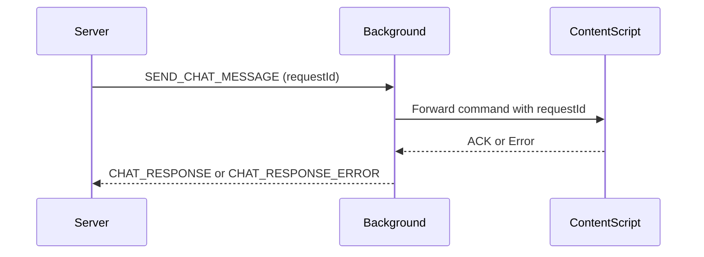

# Background Script Architecture (`background.js`)

This document explains the structure and behavior of the [`background.js`](extension/background.js:1) script, which acts as the coordination layer between the browser, content scripts, and the external WebSocket relay server.

---

## 🧩 Overview

The background script performs five key functions:

1. Connects to a central WebSocket relay server.
2. Handles incoming `SEND_CHAT_MESSAGE` commands.
3. Determines the best tab to route each command to.
4. Forwards commands to `content.js`.
5. Relays back any errors to the server.

---

## ⚙️ WebSocket Lifecycle

### Startup

- Load settings via [`loadSettingsAndConnect()`](extension/background.js:28)
- Check health endpoint: [`/health`](extension/background.js:51)
- If OK, start [`attemptWebSocketConnection()`](extension/background.js:76)

### Connection Events

- `onopen`: Connection established
- `onmessage`: Handle relay command (e.g., [`SEND_CHAT_MESSAGE`](extension/background.js:92))
- `onclose`: Clean up, schedule reconnect
- `onerror`: Logged but not retried directly

---

## 🔄 Message Flow



---

## 📌 State

- [`relaySocket`](extension/background.js:10): Active WebSocket
- [`activeTabId`](extension/background.js:13): Last successful tab
- [`lastRequestId`](extension/background.js:15): For current message
- [`processingRequest`](extension/background.js:16): Concurrency flag
- [`pendingRequests`](extension/background.js:17): Queue for future

---

## 🔧 Command Handling

- Incoming message: [`onmessage`](extension/background.js:88)
- If type is `SEND_CHAT_MESSAGE`, it clears [`pendingRequests`](extension/background.js:101), updates globals, and forwards to content
- [`forwardCommandToContentScript()`](extension/background.js:145) pings known tab or scans for valid tab (`chatgpt.com`, `aistudio`, etc.)
- Sets `lastKnownRequestId` in [`debuggerAttachedTabs`](extension/background.js:24)

---

## 🛡️ Error Handling

- If no tab found or failure: sends [`CHAT_RESPONSE_ERROR`](extension/background.js:203)
- If `chrome.runtime.lastError`: fallback and log
- All retry logic is bounded and observable

---

## 🧠 Debugger Coordination

Maintains a `debuggerAttachedTabs` map keyed by tabId, storing:

```js
{
  providerName,
  patterns,
  isFetchEnabled,
  isAttached,
  lastKnownRequestId
}
```

Used to route debugger data back to correct content script or relay logic.

---

## ✅ Summary

[`background.js`](extension/background.js:1) is the broker between remote commands and browser tabs. It ensures reliability via health checks, dynamic tab discovery, request tracking, and robust error handling.