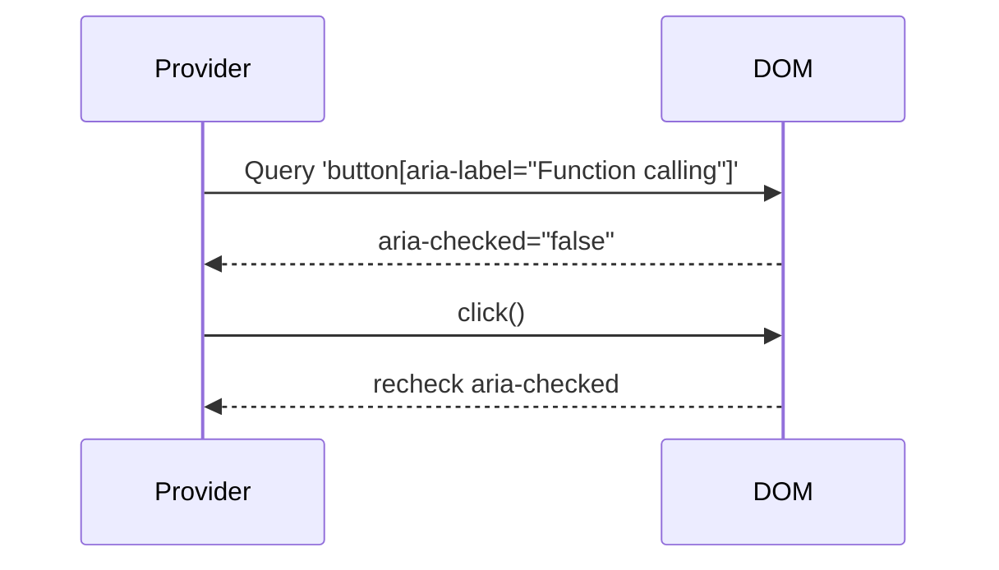
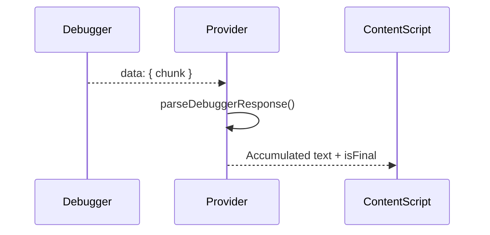

# Consolidated Provider Documentation
This document provides a comprehensive overview of the provider architecture used within the extension, including the utility script for managing providers and detailed descriptions of individual providers like AI Studio and ChatGPT.
---
## 1. Provider Utils (`provider-utils.js`)
The [`provider-utils.js`](extension/providers/provider-utils.js:1) script is crucial for managing provider registration and enabling dynamic lookup based on the current website domain.
### 🧩 Overview
This module is injected into the global `window` object as `window.providerUtils` and offers two core functions:
- [`registerProvider()`](extension/providers/provider-utils.js:7): Registers a provider instance with one or more domains.
- [`detectProvider()`](extension/providers/provider-utils.js:19): Looks up a provider instance based on the current hostname.
### 🌍 Provider Registry
Internally, the registry is held in:
```js
const providerMap = {}; // domain -> { name, instance }
```
Providers are registered like:
```js
registerProvider("AIStudioProvider", ["aistudio.google.com"], new AIStudioProvider());
```
This allows matching providers to be reused across multiple domains if necessary.
### 🔍 Provider Detection
The function [`detectProvider(hostname)`](extension/providers/provider-utils.js:19) performs a partial match against the registered `domainKey`s to determine the best match.
If no match is found, it returns `null` and logs the result.
### 🔐 Error Handling
- Validates types of all registration arguments.
- Logs malformed or missing hostnames during detection.
- Silently fails for misconfiguration, aiding fault tolerance.
### 🧪 Debug Logging
- Logs the entire provider map for visibility on each detection.
- Confirms successful matches and domain checks.
### ✅ Summary
[`provider-utils.js`](extension/providers/provider-utils.js:1) provides a lightweight and dynamic mechanism for associating hostnames with provider implementations. It ensures extensibility for future integrations while remaining simple and debuggable.
---
## 2. AI Studio Provider (`AIStudioProvider`)
The [`AIStudioProvider`](extension/providers/aistudio.js:3) class is used to interact with Google AI Studio's web interface.
### 🧩 Overview
[`AIStudioProvider`](extension/providers/aistudio.js:3) is a browser-automated provider class for sending messages and capturing responses from `aistudio.google.com`. It offers support for DOM or Chrome Debugger-based response parsing and optionally enables function-calling features.
### ⚙️ Configurable Options
```js
this.captureMethod = "debugger"; // or "dom"
this.debuggerUrlPattern = "*MakerSuiteService/GenerateContent*";
this.includeThinkingInMessage = false;
this.ENABLE_AISTUDIO_FUNCTION_CALLING = true;
```
These parameters control how responses are captured and whether additional intermediate output like “thinking” is included in results.
### 📌 DOM Selectors
- Input field: [`this.inputSelector`](extension/providers/aistudio.js:24)
- Send button: [`this.sendButtonSelector`](extension/providers/aistudio.js:27)
- Main response blocks: [`this.responseSelector`](extension/providers/aistudio.js:30)
- Typing indicators: [`this.thinkingIndicatorSelector`](extension/providers/aistudio.js:33)
Fallback selectors are used when DOM capture is selected and standard elements fail.
### 🔄 Lifecycle
#### 1. Initialization
- Assigns selectors and default behavior
- Enables function calling via [`ensureFunctionCallingEnabled()`](extension/providers/aistudio.js:72)
- Binds to `window.navigation` for SPA-aware page detection
#### 2. Message Sending
- [`sendChatMessage(text)`](extension/providers/aistudio.js:131): Finds input field and button, inserts text, and triggers a click with retry and verification logic.
#### 3. Response Capture
##### Method: Debugger
- Registers callback: [`initiateResponseCapture()`](extension/providers/aistudio.js:209)
- Handles debugger message: [`handleDebuggerData()`](extension/providers/aistudio.js:226)
- Parses chunks via [`parseDebuggerResponse()`](extension/providers/aistudio.js:439)
##### Method: DOM
- Starts mutation observer loop: [`_startDOMMonitoring()`](extension/providers/aistudio.js:598)
- Identifies end of generation: [`_isResponseStillGeneratingDOM()`](extension/providers/aistudio.js:577)
### 🛡️ Error & Edge Case Handling
- Detects failed button presses
- Gracefully handles unknown capture methods
- Times out function-calling polling after 7s with fallback logging
### 🔧 Function Calling Enable Logic

### ✅ Summary
This provider enables integration with AI Studio via browser automation. Its flexibility in capture methods and dynamic DOM monitoring makes it robust for a range of layout changes or interface evolutions.
---
## 3. ChatGPT Provider (`ChatGptProvider`)
The [`ChatGptProvider`](extension/providers/chatgpt.js:3) class automates and captures interactions with `chatgpt.com`.
### 🧩 Overview
[`ChatGptProvider`](extension/providers/chatgpt.js:3) enables message injection, UI automation, and response capture from ChatGPT via DOM or Chrome Debugger methods. It uses retry logic for robust message delivery and streaming capture for response chunks.
### ⚙️ Configurable Parameters
```js
this.captureMethod = "debugger"; // or "dom"
this.debuggerUrlPattern = "*chatgpt.com/backend-api/conversation*";
this.includeThinkingInMessage = true;
```
These control the response source (network or UI) and message formatting behavior.
### 📌 DOM Elements
- Input: [`#prompt-textarea`](extension/providers/chatgpt.js:12)
- Send button: [`#composer-submit-button`](extension/providers/chatgpt.js:13)
- Response area: [`.message-bubble .text-content`](extension/providers/chatgpt.js:14)
- Loading spinner: [`.loading-spinner`](extension/providers/chatgpt.js:15)
- Fallback DOM: [`.message-container .response-text`](extension/providers/chatgpt.js:16)
### 🔄 Lifecycle
#### 1. Initialization
- Sets up DOM selectors and state containers
- Initializes request tracking maps and debug logs
#### 2. Sending Messages
- [`sendChatMessage()`](extension/providers/chatgpt.js:25):
  - Finds input + button, injects message
  - Retries on failure (up to 5 times)
  - Waits between attempts and checks element readiness
#### 3. Capturing Responses
##### A. Debugger Mode
- Callback registration via [`initiateResponseCapture()`](extension/providers/chatgpt.js:105)
- Processes data in [`handleDebuggerData()`](extension/providers/chatgpt.js:121)
- Uses accumulator map for text chunk assembly and [`parseDebuggerResponse()`](extension/providers/chatgpt.js:199) to interpret SSE stream format
##### B. DOM Mode
- Starts DOM observer loop via [`_startDOMMonitoring()`](extension/providers/chatgpt.js:499)
- Stops when [`_isResponseStillGeneratingDOM()`](extension/providers/chatgpt.js:489) returns false
### 🛡️ Error Handling
- [`_reportSendError()`](extension/providers/chatgpt.js:93) reports issues back to callback
- Handles:
  - Missing input or button
  - Disabled controls
  - Empty raw debugger data
  - Unparseable or non-relevant JSON payloads
### 🧠 Streaming SSE Parse Logic

### ✅ Summary
The ChatGPT provider is designed for robust interaction with ChatGPT's UI or network. It supports retries, error recovery, and chunked response reconstruction, ensuring high reliability and compatibility across updates to the site's frontend.
---
## 4. Claude Provider (`ClaudeProvider`)
The [`ClaudeProvider`](./provider-claude.md) class is used to interact with Anthropic's Claude AI models via the `claude.ai` web interface.

### 🧩 Overview
[`ClaudeProvider`](./provider-claude.md) primarily uses the Chrome DevTools Debugger API to intercept and process Server-Sent Events (SSE) for streaming responses from `claude.ai`.

### âš™ï¸  Configurable Options
```js
this.captureMethod = "debugger";
this.debuggerUrlPattern = "*/completion*"; // Matches Claude's streaming endpoint
this.includeThinkingInMessage = false; // Default, focuses on final answer
this.ENABLE_CLAUDE_FUNCTION_CALLING = true; // Currently unused, logic commented out
```
These parameters control how responses are captured.

### 📌 DOM Selectors
- Input field: [`this.inputSelector`](extension/providers/claude.js:24) (`div.ProseMirror[contenteditable="true"]`)
- Send button: [`this.sendButtonSelector`](extension/providers/claude.js:27) (`button[aria-label="Send message"]`)
- Response area (for DOM fallback): [`this.responseSelector`](extension/providers/claude.js:30)
- Thinking indicator (for DOM fallback): [`this.thinkingIndicatorSelector`](extension/providers/claude.js:33)

### 🔄 Lifecycle
#### 1. Initialization
- Assigns selectors and default behavior.
- Initializes `pendingResponseCallbacks` and `requestBuffers` for managing streaming responses.
- (Function calling enablement logic is currently commented out).
#### 2. Message Sending
- [`sendChatMessage(messageContent)`](extension/providers/claude.js:135):
  - Handles string, Blob, or array (text/image_url) content.
  - Sets text content on the input field.
  - Dispatches a `ClipboardEvent('paste')` for image data.
  - Clicks the send button with retry logic if initially disabled.
#### 3. Response Capture (Debugger Method)
- Callback registration via [`initiateResponseCapture()`](extension/providers/claude.js:264).
- Handles debugger data in [`handleDebuggerData()`](extension/providers/claude.js:281):
  - Accumulates text from multiple SSE chunks in `requestBuffers`.
  - Uses [`parseDebuggerResponse()`](extension/providers/claude.js:336) to interpret Claude's SSE stream.
  - Calls the main response callback only with the complete message when `includeThinkingInMessage` is `false` and an end-of-message event (`message_stop` or `message_delta` with `stop_reason`) is detected, or when the background script signals the absolute end of the stream.

### 🧠 Streaming SSE Parse Logic (`parseDebuggerResponse`)
- Splits raw data into individual SSE messages.
- Extracts `event:` type and `data:` payload.
- Appends text from `content_block_delta` events.
- Sets `isFinalResponse: true` if `event: message_stop` is seen or if `event: message_delta` contains a `stop_reason`.

### ✅ Summary
The Claude provider enables integration with `claude.ai` by intercepting and parsing its SSE stream. Its logic is tailored to accumulate streamed message parts and deliver a complete response.

---
## 5. Provider Comparison
This section compares `extension/providers/chatgpt.js` and `extension/providers/aistudio.js`.
### 1. Configurable Properties
| Property                   | ChatGptProvider                          | AIStudioProvider                                        |
| -------------------------- | ---------------------------------------- | ------------------------------------------------------- |
| `captureMethod`            | "debugger"                               | "debugger"                                              |
| `debuggerUrlPattern`       | `*chatgpt.com/backend-api/conversation*` | `*MakerSuiteService/GenerateContent*`                   |
| `includeThinkingInMessage` | `true`                                   | `false`                                                 |
| Function calling toggle    | N/A                                      | `ENABLE_AISTUDIO_FUNCTION_CALLING` (with polling logic) |
### 2. Provider Identity
* **Name**:
  * ChatGPT: `ChatGptProvider`
  * AI Studio: `AIStudioProvider`
* **Supported Domains**:
  * ChatGPT: `["chatgpt.com"]`
  * AI Studio: `["aistudio.google.com"]`
### 3. Selectors & UI Interactions
| Selector Type            | ChatGPT (`chatgpt.js`)               | AI Studio (`aistudio.js`)                                    |
| ------------------------ | ------------------------------------ | ------------------------------------------------------------ |
| Input Field              | `#prompt-textarea`                   | `textarea.textarea`, `textarea.gmat-body-medium`, etc.       |
| Send Button              | `button[data-testid="send-button"]`  | `button.run-button`, `button[aria-label="Run"]`, etc.        |
| Response Capture (DOM)   | `.message-bubble .text-content`      | `.response-container`, `.model-response`, `.cmark-node`, ... |
| Thinking Indicator (DOM) | `.loading-spinner`, `.thinking-dots` | `.thinking-indicator`, `.loading-indicator`, etc.            |
### 4. Message Sending Logic
* **ChatGptProvider**:
  * Supports string, Blob, and array payloads.
  * Sets `innerText` on a contenteditable div, uses `ClipboardEvent('paste')` for images.
  * Retries clicking send up to 5 times with exponential backoff.
* **AIStudioProvider**:
  * Handles similar payload types but pastes via `inputField.value` and paste event.
  * Retries send click up to 60 attempts (5-minute total), triggering UI events to enable button.
### 5. Response Capture Mechanisms
* **Debugger-Based Streaming**:
  * **ChatGPT**: Complex SSE parsing supporting thoughts, reasoning recaps, JSON patches, and OpenAI deltas.
  * **AI Studio**: Simplified JSON array parsing with `extractTextSegments` and `findEndOfUnitMarker`, plus `includeThinkingInMessage` toggle.
* **DOM Fallback**:
  * Both implement DOM monitoring, but selectors and timing differ:
    * ChatGPT polls every 500ms, with stability checks and cleanup on final.
    * AI Studio polls every 1s up to 15s, with fallback search through multiple DOM patterns.
### 6. Registration
Both providers register themselves via:
```js
window.providerUtils.registerProvider(
  providerInstance.name,
  providerInstance.supportedDomains,
  providerInstance
);
```
### Summary of Key Differences:
1.  **Parsing complexity**: ChatGPT provider includes extensive SSE parsing for multiple content types, while AI Studio uses a simpler array-based JSON parsing.
2.  **Thinking inclusion**: ChatGPT merges thoughts and content by default; AI Studio omits thoughts unless toggled.
3.  **UI selectors**: AI Studio supports diverse textarea and button selectors for its SPA, plus function calling toggle logic.
4.  **Retry strategy**: ChatGPT uses a 5-attempt loop; AI Studio retries over a longer window (up to 5 minutes).
This comparison highlights the design choices and implementations of each provider.
---
## 6. Conclusion
This consolidated documentation provides a holistic view of the provider architecture, detailing the utilities for managing providers and the specifics of the AI Studio, ChatGPT, and Claude providers. This unified approach aims to simplify understanding and maintenance of the provider system.