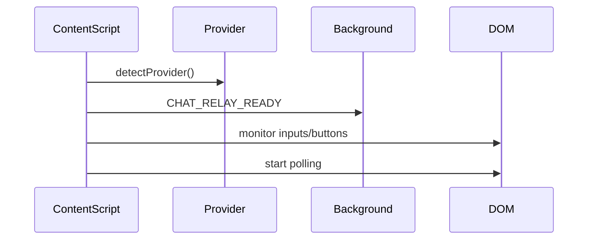

# Content Script Architecture (`content.js`)

This document describes the structure and flow of [`content.js`](extension/content.js:1), which acts as the in-page automation engine for injecting chat messages and monitoring responses in various AI web interfaces.

---

## 🧩 Overview

The content script:

1. Detects which AI platform is active (e.g., ChatGPT, AI Studio).
2. Loads the appropriate provider.
3. Sends chat messages programmatically.
4. Monitors the DOM for typed/streamed responses.
5. Reports back results to the background script.

---

## ⚙️ Initialization

### Boot Sequence

- Executed on load: [`initializeContentRelay()`](extension/content.js:60)
- Identifies provider using `window.providerUtils`
- Sends [`CHAT_RELAY_READY`](extension/content.js:105) to background
- Sets up provider capture and polling logic



---

## 📌 DOM Utilities

- Element detection: [`findPotentialSelectors()`](extension/content.js:18)
- Polling loop: [`startElementPolling()`](extension/content.js:139)

Searches for selectors like:

```js
provider.inputSelector
provider.sendButtonSelector
provider.responseSelector
```

---

## 💬 Message Injection

### Method: [`sendChatMessage(text)`](extension/content.js:172)

- Calls [`sendChatMessageWithRetry()`](extension/content.js:183)
- Retries sending if button/input not ready
- Uses `provider.sendChatMessage()`

---

## 📥 Response Capture

### A. DOM Monitoring

- [`setupAutomaticResponseCapture()`](extension/content.js:338): sets MutationObserver
- [`startMonitoringForResponse()`](extension/content.js:255): begins timed attempts
- Captures response with [`captureResponse()`](extension/content.js:505)

### B. Completion Detection

Platform-specific heuristics like:

- [`monitorGeminiResponse()`](extension/content.js:436)
- [`monitorResponseCompletion()`](extension/content.js:391)

---

## 🔁 Provider Coordination

- Uses shared `provider` object initialized at runtime
- Each provider has methods like:
  - `sendChatMessage()`
  - `getStreamingApiPatterns()`
  - `shouldSkipResponseMonitoring()`

---

## 🛡️ Fault Recovery

- Logs missing selectors or failures
- Retries up to 5x for message dispatch
- Reports failure back to background

---

## ✅ Summary

[`content.js`](extension/content.js:1) dynamically adapts to different AI platforms to send and monitor chat activity. It forms the frontend relay bridge between user intent (via server) and provider-specific DOM interfaces.