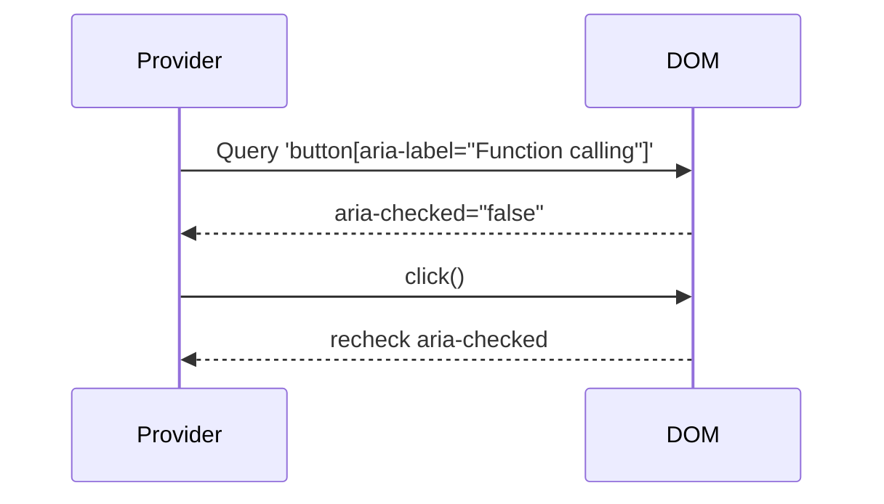

# AI Studio Provider Architecture

This document outlines the implementation and operational logic of the [`AIStudioProvider`](extension/providers/aistudio.js:3) class used in the extension to interact with Google AI Studio's web interface.

---

## 🧩 Overview

[`AIStudioProvider`](extension/providers/aistudio.js:3) is a browser-automated provider class for sending messages and capturing responses from `aistudio.google.com`. It offers support for DOM or Chrome Debugger-based response parsing and optionally enables function-calling features.

---

## ⚙️ Configurable Options

```js
this.captureMethod = "debugger"; // or "dom"
this.debuggerUrlPattern = "*MakerSuiteService/GenerateContent*";
this.includeThinkingInMessage = false;
this.ENABLE_AISTUDIO_FUNCTION_CALLING = true;
```

These parameters control how responses are captured and whether additional intermediate output like “thinking” is included in results.

---

## 📌 DOM Selectors

- Input field: [`this.inputSelector`](extension/providers/aistudio.js:24)
- Send button: [`this.sendButtonSelector`](extension/providers/aistudio.js:27)
- Main response blocks: [`this.responseSelector`](extension/providers/aistudio.js:30)
- Typing indicators: [`this.thinkingIndicatorSelector`](extension/providers/aistudio.js:33)

Fallback selectors are used when DOM capture is selected and standard elements fail.

---

## 🔄 Lifecycle

### 1. Initialization
- Assigns selectors and default behavior
- Enables function calling via [`ensureFunctionCallingEnabled()`](extension/providers/aistudio.js:72)
- Binds to `window.navigation` for SPA-aware page detection

### 2. Message Sending
- [`sendChatMessage(text)`](extension/providers/aistudio.js:131): Finds input field and button, inserts text, and triggers a click with retry and verification logic.

### 3. Response Capture

#### Method: Debugger
- Registers callback: [`initiateResponseCapture()`](extension/providers/aistudio.js:209)
- Handles debugger message: [`handleDebuggerData()`](extension/providers/aistudio.js:226)
- Parses chunks via [`parseDebuggerResponse()`](extension/providers/aistudio.js:439)

#### Method: DOM
- Starts mutation observer loop: [`_startDOMMonitoring()`](extension/providers/aistudio.js:598)
- Identifies end of generation: [`_isResponseStillGeneratingDOM()`](extension/providers/aistudio.js:577)

---

## 🛡️ Error & Edge Case Handling

- Detects failed button presses
- Gracefully handles unknown capture methods
- Times out function-calling polling after 7s with fallback logging

---

## 🔧 Function Calling Enable Logic



---

## ✅ Summary

This provider enables integration with AI Studio via browser automation. Its flexibility in capture methods and dynamic DOM monitoring makes it robust for a range of layout changes or interface evolutions.