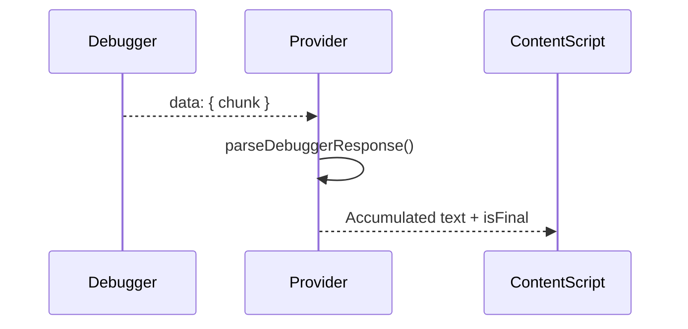

# ChatGPT Provider Architecture

This document describes the implementation details of the [`ChatGptProvider`](extension/providers/chatgpt.js:3) class used to automate and capture interactions with `chatgpt.com`.

---

## 🧩 Overview

[`ChatGptProvider`](extension/providers/chatgpt.js:3) enables message injection, UI automation, and response capture from ChatGPT via DOM or Chrome Debugger methods. It uses retry logic for robust message delivery and streaming capture for response chunks.

---

## ⚙️ Configurable Parameters

```js
this.captureMethod = "debugger"; // or "dom"
this.debuggerUrlPattern = "*chatgpt.com/backend-api/conversation*";
this.includeThinkingInMessage = true;
```

These control the response source (network or UI) and message formatting behavior.

---

## 📌 DOM Elements

- Input: [`#prompt-textarea`](extension/providers/chatgpt.js:12)
- Send button: [`#composer-submit-button`](extension/providers/chatgpt.js:13)
- Response area: [`.message-bubble .text-content`](extension/providers/chatgpt.js:14)
- Loading spinner: [`.loading-spinner`](extension/providers/chatgpt.js:15)
- Fallback DOM: [`.message-container .response-text`](extension/providers/chatgpt.js:16)

---

## 🔄 Lifecycle

### 1. Initialization

- Sets up DOM selectors and state containers
- Initializes request tracking maps and debug logs

### 2. Sending Messages

- [`sendChatMessage()`](extension/providers/chatgpt.js:25):
  - Finds input + button, injects message
  - Retries on failure (up to 5 times)
  - Waits between attempts and checks element readiness

### 3. Capturing Responses

#### A. Debugger Mode

- Callback registration via [`initiateResponseCapture()`](extension/providers/chatgpt.js:105)
- Processes data in [`handleDebuggerData()`](extension/providers/chatgpt.js:121)
- Uses accumulator map for text chunk assembly and [`parseDebuggerResponse()`](extension/providers/chatgpt.js:199) to interpret SSE stream format

#### B. DOM Mode

- Starts DOM observer loop via [`_startDOMMonitoring()`](extension/providers/chatgpt.js:499)
- Stops when [`_isResponseStillGeneratingDOM()`](extension/providers/chatgpt.js:489) returns false

---

## 🛡️ Error Handling

- [`_reportSendError()`](extension/providers/chatgpt.js:93) reports issues back to callback
- Handles:
  - Missing input or button
  - Disabled controls
  - Empty raw debugger data
  - Unparseable or non-relevant JSON payloads

---

## 🧠 Streaming SSE Parse Logic



---

## ✅ Summary

The ChatGPT provider is designed for robust interaction with ChatGPT's UI or network. It supports retries, error recovery, and chunked response reconstruction, ensuring high reliability and compatibility across updates to the site's frontend.