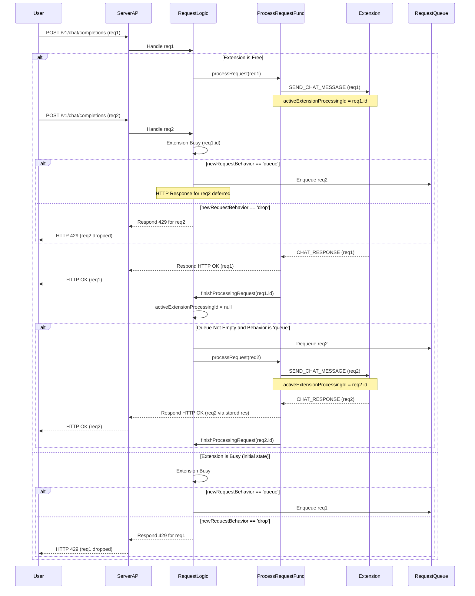

# Server Architecture Overview

This document outlines the architecture and operation of the WebSocket relay server found in [`api-relay-server/src/server.ts`](api-relay-server/src/server.ts). The system acts as an intermediary between browser extensions and an HTTP-based API, routing JSON messages bi-directionally, and managing request flow to prevent overloading the browser extension.

---

## 🌐 Server Layers

```mermaid
graph TD
    subgraph HTTP Layer
        A[Express App] --> B{/v1/chat/completions}
    end

    subgraph Request Handling Logic
        B -- Request --> C{Extension Busy?}
        C -- No --> D[processRequest()]
        C -- Yes --> E{Behavior: Drop or Queue?}
        E -- Drop --> F[Respond 429]
        E -- Queue --> G[requestQueue]
        G -- Dequeue --> D
    end

    subgraph WebSocket Communication
        D -- SEND_CHAT_MESSAGE --> H[activeConnections[0]]
        H -- CHAT_RESPONSE_* --> I[WebSocket Server]
        I -- Resolve/Reject --> D
    end
    
    D --> J[pendingRequests Map]
    D --> K[finishProcessingRequest()]

    subgraph Admin UI & Config
        L[Express App] --> M[/admin & /v1/admin/*]
        M <--> N[server-config.json]
    end
```

---

## 📁 Core File

- [`server.ts`](api-relay-server/src/server.ts): Main file where the entire Express server, WebSocket infrastructure, request queuing, and admin interface logic is defined.

---

## 🧩 Components

### 1. Express HTTP API

- **`/v1/chat/completions`**: Accepts OpenAI-compatible requests.
    - Implements logic to check if a browser extension is busy (via `activeExtensionProcessingId`).
    - Based on `newRequestBehavior` setting ('queue' or 'drop'):
        - **Queue**: Adds incoming request to `requestQueue` if extension is busy. The HTTP response is deferred.
        - **Drop**: Responds with 429 Too Many Requests if extension is busy.
    - If extension is free, directly calls `processRequest()`.
- **`/v1/admin/server-info`**: Provides current server status and configuration, including `port`, `requestTimeoutMs`, and `newRequestBehavior`.
- **`/v1/admin/update-settings`**: Allows updating `port`, `requestTimeoutMs`, and `newRequestBehavior`. Changes are saved to `server-config.json`.
- **`/v1/admin/message-history`**: Retrieves recent message logs for the admin UI.
- **`/v1/admin/restart-server`**: Triggers a server restart.
- **`/admin`**: Serves the admin HTML interface.
- **`/health`**: Basic health check.

### 2. WebSocket Server

- [`WebSocketServer`](api-relay-server/src/server.ts:146): Accepts WebSocket connections from browser extensions.
- [`activeConnections`](api-relay-server/src/server.ts:43): Array storing active WebSocket client connections. Currently, only the first connection (`activeConnections[0]`) is used for sending messages.
- **Message Handling**: Receives messages from the extension (e.g., `CHAT_RESPONSE`, `CHAT_RESPONSE_CHUNK`, `CHAT_RESPONSE_ERROR`) and resolves or rejects promises in the `pendingRequests` map.

### 3. Queuing & Processing System

- **`activeExtensionProcessingId: number | null`**: Tracks the `requestId` of the message currently being processed by the extension. If `null`, the extension is considered free.
- **`newRequestBehavior: 'queue' | 'drop'`**: Global variable determining how to handle new requests when the extension is busy. Loaded from `server-config.json` (defaults to 'queue').
- **`requestQueue: QueuedRequest[]`**: An in-memory array holding `QueuedRequest` objects when `newRequestBehavior` is 'queue' and the extension is busy.
- **`QueuedRequest` Interface**: Defines the structure for storing an original HTTP request (`req`, `res`) and its parameters, to be processed later.
- **`async function processRequest(queuedItem: QueuedRequest)`**:
    - Sets `activeExtensionProcessingId` to the current `queuedItem.requestId`.
    - Logs `CHAT_REQUEST_PROCESSING`.
    - Sends the `SEND_CHAT_MESSAGE` to the extension via WebSocket.
    - Manages a `Promise` in `pendingRequests` for the response, including a timeout (`currentRequestTimeoutMs`).
    - On response/error/timeout, formats and sends the HTTP response using the stored `queuedItem.res`.
    - Calls `finishProcessingRequest()` in a `finally` block.
- **`function finishProcessingRequest(completedRequestId: number)`**:
    - Clears `activeExtensionProcessingId`.
    - Removes the request from `pendingRequests`.
    - If `newRequestBehavior` is 'queue' and `requestQueue` is not empty, dequeues the next request and calls `processRequest()` for it.

### 4. State Management

- [`pendingRequests`](api-relay-server/src/server.ts:44): A `Map` that stores `Promise` resolve/reject handlers, keyed by `requestId`. Used by `processRequest` to await responses from the WebSocket.
- [`requestCounter`](api-relay-server/src/server.ts:45): Generates unique `requestId`s.
- [`adminMessageHistory`](api-relay-server/src/server.ts:90): In-memory store for admin log entries.

---

## 🔄 Lifecycle Flow (with Queuing)



---

## 🛡️ Error Handling

- If no browser extension is connected when a request arrives: Server responds with `503 Service Unavailable`.
- If no browser extension is connected when `processRequest` attempts to send a message (e.g., after being dequeued): The request is failed, and an error is sent to the original client if headers not already sent.
- If `newRequestBehavior` is 'drop' and the extension is busy: Server responds with `429 Too Many Requests`.
- Request Timeout: Each request processed by `processRequest` has a timeout (`currentRequestTimeoutMs`, configurable). If the extension doesn't respond in time, the promise is rejected, and an error is sent to the client.
- Errors from extension (`CHAT_RESPONSE_ERROR`): Logged, and the corresponding request promise is rejected, leading to an error response to the client.

---

## ⚙️ Configuration

The server's behavior can be configured via `server-config.json` located in the `dist` directory (created/managed by `server.ts`). The Admin UI also allows viewing and modifying these settings.

Key configurable options:
- **`port`**: The port on which the server listens. Requires server restart.
- **`requestTimeoutMs`**: Timeout in milliseconds for waiting for a response from the browser extension. Effective immediately.
- **`newRequestBehavior`**: Determines how new requests are handled if the extension is busy. Can be:
    - `'queue'` (default): New requests are queued and processed sequentially.
    - `'drop'`: New requests are rejected with a 429 error.
    Effective immediately.

---

## 🔌 Connection Monitoring

- The server maintains an array of `activeConnections`.
- WebSocket connections have built-in ping/pong mechanisms for keep-alive, managed by the `ws` library. Explicit server-side ping logic is not currently implemented in `server.ts`.
- Disconnected clients are removed from `activeConnections`.
- `pendingRequests` are cleared on timeout or when a request completes (successfully or with an error) via `finishProcessingRequest`.

---

## ✅ Summary

This architecture creates a decoupled, resilient relay system. The new queuing/dropping mechanism ensures that the browser extension processes only one message at a time, preventing race conditions and allowing for configurable behavior when the extension is busy. The Admin UI provides visibility and control over key operational parameters.