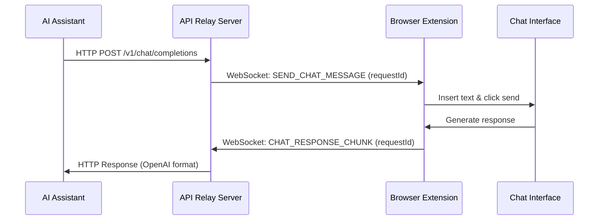

# Chat Relay System: Comprehensive User Manual

## Table of Contents

1. [Introduction](#introduction)
   - [Purpose](#purpose)
   - [System Overview](#system-overview)
   - [Key Features](#key-features)

2. [System Architecture](#system-architecture)
   - [Components](#components)
   - [Data Flow](#data-flow)
   - [Port Configuration](#port-configuration)

3. [Installation and Setup](#installation-and-setup)
   - [Prerequisites](#prerequisites)
   - [API Relay Server Setup](#api-relay-server-setup)
   - [Browser Extension Setup](#browser-extension-setup)
   - [MCP Server Setup](#mcp-server-setup)

4. [Configuration](#configuration)
   - [API Relay Server Configuration](#api-relay-server-configuration)
   - [Browser Extension Configuration](#browser-extension-configuration)
   - [MCP Server Configuration](#mcp-server-configuration)
   - [Cline/RooCode Configuration](#clineroocode-configuration)

5. [Usage Guide](#usage-guide)
   - [Basic Usage](#basic-usage)
   - [Using with Cline/RooCode](#using-with-clineroocode)
   - [Using with MCP Server](#using-with-mcp-server)
   - [Advanced Usage Examples](#advanced-usage-examples)

6. [MCP Server Functionality](#mcp-server-functionality)
   - [Available Tools](#available-tools)
   - [Sending Messages](#sending-messages)
   - [Integration with AI Models](#integration-with-ai-models)
   - [Example Use Cases](#example-use-cases)

7. [Troubleshooting](#troubleshooting)
   - [API Relay Server Issues](#api-relay-server-issues)
   - [Browser Extension Issues](#browser-extension-issues)
   - [MCP Server Issues](#mcp-server-issues)
   - [WebSocket Connection Issues](#websocket-connection-issues)

8. [Developer Reference](#developer-reference)
   - [API Endpoints](#api-endpoints)
   - [WebSocket Protocol](#websocket-protocol)
   - [Provider Architecture](#provider-architecture)
   - [MCP Server API](#mcp-server-api)

9. [Appendices](#appendices)
   - [Glossary](#glossary)
   - [Default Port Reference](#default-port-reference)
   - [File Structure](#file-structure)

---

## Introduction

### Purpose

The Chat Relay System enables communication between AI assistants like Cline/RooCode and web-based AI chat interfaces such as Gemini, AI Studio, ChatGPT, and Claude. It provides an OpenAI-compatible API that allows these assistants to interact with web-based chat interfaces that may not have public APIs or have different capabilities through their web interfaces.

### System Overview

The Chat Relay System consists of three main components:

1. **API Relay Server**: An Express.js server that implements an OpenAI-compatible API endpoint and manages WebSocket connections with browser extensions.

2. **Browser Extension**: A Chrome extension that connects to the API Relay Server via WebSocket and interacts with web-based chat interfaces.

3. **MCP Server**: A Model Context Protocol (MCP) server that provides additional tools and resources for the system, enabling AI assistants to send messages through the relay.

Together, these components create a seamless bridge between AI assistants and web-based chat interfaces, allowing for powerful interactions and capabilities.

### Key Features

- **OpenAI-Compatible API**: Implements the `/v1/chat/completions` endpoint that Cline/RooCode can connect to.
- **Real-time Communication**: Uses WebSockets for efficient, real-time communication between components.
- **Multiple Chat Interface Support**: Works with Gemini, AI Studio, ChatGPT, and Claude.
- **Modular Provider Architecture**: Easily extendable to support additional chat interfaces.
- **MCP Integration**: Provides tools for AI assistants to interact with the system programmatically.
- **Robust Error Handling**: Includes timeout handling, retry mechanisms, and detailed logging.

---

## System Architecture

### Components

#### 1. API Relay Server

The API Relay Server is an Express.js application that serves as the central hub of the Chat Relay System. It provides:

- An OpenAI-compatible REST API for AI assistants to connect to
- A WebSocket server for real-time communication with browser extensions
- Request tracking and management
- Response formatting and delivery

#### 2. Browser Extension

The Browser Extension is a Chrome extension that:

- Connects to the API Relay Server via WebSocket
- Injects content scripts into supported chat interfaces
- Sends messages to chat interfaces
- Captures responses using DOM manipulation and the Chrome debugger API
- Relays responses back to the API Relay Server

#### 3. MCP Server

The MCP (Model Context Protocol) Server is a Node.js application that:

- Provides tools for AI assistants to interact with the Chat Relay System
- Enables sending messages through the API Relay Server
- Receives responses from chat interfaces
- Offers a standardized interface for AI assistants to use

### Data Flow

The data flow through the Chat Relay System follows these steps:

1. **AI Assistant to API Relay Server**:
   - AI assistant sends an HTTP POST request to `/v1/chat/completions`
   - Request includes the message and optional parameters

2. **API Relay Server to Browser Extension**:
   - API Relay Server assigns a unique `requestId` to the message
   - Message is sent to the Browser Extension via WebSocket

3. **Browser Extension to Chat Interface**:
   - Browser Extension identifies the appropriate chat interface
   - Message is inserted into the chat input field
   - Send button is clicked to submit the message

4. **Chat Interface to Browser Extension**:
   - Browser Extension captures the response from the chat interface
   - Response is associated with the original `requestId`

5. **Browser Extension to API Relay Server**:
   - Response is sent back to the API Relay Server via WebSocket
   - API Relay Server matches the response to the original request

6. **API Relay Server to AI Assistant**:
   - Response is formatted in OpenAI-compatible JSON structure
   - Formatted response is sent back to the AI assistant



### Port Configuration

The Chat Relay System uses several ports for communication between components:

| Component | Default Port | Protocol | Description |
|-----------|--------------|----------|-------------|
| API Relay Server | 3003 | HTTP | REST API endpoint for AI assistants |
| API Relay Server | 3003 | WebSocket | WebSocket server for browser extensions |
| MCP Server | N/A | stdio | Uses standard input/output for communication |

---

## Installation and Setup

### Prerequisites

Before installing the Chat Relay System, ensure you have the following:

- **Node.js**: Version 18.19.0 or higher
- **npm**: Version 6.0.0 or higher
- **Chrome**: Latest version recommended
- **Git**: For cloning the repository

### API Relay Server Setup

1. **Clone the repository** (if you haven't already):
   ```bash
   git clone https://github.com/binarybeastmaster/chat-relay.git
   cd chat-relay
   ```

2. **Install dependencies**:
   ```bash
   cd api-relay-server
   npm install
   ```

3. **Start the server**:
   ```bash
   nodemon start
   ```

   The server will start on port 3003 by default. You should see output similar to:
   ```
   OpenAI-compatible relay server running on port 3003
   WebSocket server for browser extensions running on ws://localhost:3003
   ```

### Browser Extension Setup

1. **Build the extension** (if necessary):
   ```bash
   cd extension
   # No build step required for this extension
   ```

2. **Install in Chrome**:
   - Open Chrome and navigate to `chrome://extensions/`
   - Enable "Developer mode" using the toggle in the top-right corner
   - Click "Load unpacked"
   - Select the `extension` directory from your chat-relay project

3. **Verify installation**:
   - The Chat Relay extension icon should appear in your Chrome toolbar
   - Click the icon to see the extension popup
   - The popup should indicate whether the extension is connected to the API Relay Server

### MCP Server Setup

1. **Install dependencies**:
   ```bash
   cd mcp-server
   npm install
   ```

2. **Build and install the server**:
   ```bash
    npm run build
    npm install -g .

or package installation and install

    npm run build
    npm pack
    npm install -g C:/Users/user/Projects/chat-relay/mcp-server/chat-relay-mcp-0.0.1.tgz
   ```

3. **Start the server**:
   ```bash
   npm start
   ```

   The MCP Server will start and be ready to receive commands. You should see output similar to:
   ```
   Initializing Chat Relay MCP Server...
   Registered tools using 'registerTool' method
   MCP Server started with stdio transport. Registered operations: send_message
   MCP Server is configured to communicate with API Relay Server on http://localhost:3003
   ```

4. **Global Installation** (optional):
   To make the MCP Server available globally, you can install it as a global npm package:
   ```bash
   npm install -g ./
   ```

   After global installation, you can start the MCP Server from anywhere using:
   ```bash
   chat-relay-mcp
   ```

---

## Configuration

### API Relay Server Configuration

The API Relay Server is primarily configured via the **Admin UI** or by directly editing the `api-relay-server/dist/server-config.json` file (which is created and managed by the server). Some initial defaults can also be influenced by environment variables.

#### `server-config.json`

This JSON file is automatically created by the server in the `api-relay-server/dist/` directory if it doesn't exist. It stores the following settings:

- **`port`**: The port number the server listens on.
- **`requestTimeoutMs`**: The timeout in milliseconds for waiting for a response from the browser extension.
- **`newRequestBehavior`**: Determines how new requests are handled if the browser extension is already processing a request.
    - `"queue"`: New requests are queued and processed sequentially (default).
    - `"drop"`: New requests are rejected with a 429 "Too Many Requests" error.
- **`lastRestartRequestTimestamp`**: Timestamp of the last requested server restart via the admin UI.

**Example `server-config.json`:**
```json
{
  "port": 3003,
  "requestTimeoutMs": 120000,
  "newRequestBehavior": "queue",
  "lastRestartRequestTimestamp": 1678886400000
}
```

#### Admin UI Configuration

The Admin UI, accessible at `http://localhost:<PORT>/admin` (e.g., `http://localhost:3003/admin`), provides a "Settings" tab where you can configure:

1.  **Server Port**:
    -   Displays the current port the server is configured to use.
    -   Changing this value requires a server restart to take effect. The new value is saved to `server-config.json`.
2.  **Request Timeout (ms)**:
    -   Displays and allows modification of the timeout for requests sent to the browser extension.
    -   This change is effective immediately and is saved to `server-config.json`.
3.  **New Request Behavior (if extension busy)**:
    -   Allows selection between 'Queue' and 'Drop' using radio buttons.
        -   **Queue**: If the browser extension is busy, incoming requests will be held in a queue and processed one by one as the extension becomes free.
        -   **Drop**: If the browser extension is busy, incoming requests will be immediately rejected with an error (429 Too Many Requests).
    -   This change is effective immediately and is saved to `server-config.json`.

Changes made in the Admin UI are saved to `server-config.json`.

#### Environment Variables

- **`PORT`**: Can be used to set the initial port if `server-config.json` does not exist or does not contain a port setting. Example: `PORT=3004 npm start`.
- **`REQUEST_TIMEOUT_MS`**: Can be used to set the initial request timeout if `server-config.json` does not exist or does not contain this setting.

The values from `server-config.json` take precedence over environment variables once the file is created.

### Browser Extension Configuration

The Browser Extension can be configured through its options page or by editing the source code:

#### Options Page

1. Right-click the extension icon in Chrome
2. Select "Options"
3. Configure the following settings:
   - **Server Host**: The hostname of the API Relay Server (default: `localhost`)
   - **Server Port**: The port of the API Relay Server (default: `3003`)
   - **Server Protocol**: The WebSocket protocol to use (default: `ws`)

#### Source Code Configuration

You can also configure the Browser Extension by editing the `extension/background.js` file:

```javascript
// Default settings
const DEFAULT_SETTINGS = {
  serverHost: 'localhost',
  serverPort: 3003,
  serverProtocol: 'ws'
};

// Reconnection settings
let reconnectInterval = 5000; // 5 seconds
```

### MCP Server Configuration

The MCP Server configuration is defined in the `mcp-server/src/index.ts` file:

```typescript
// Create the MCP server with configuration
const mcpServer = new MCPServer({
  transport: { type: "stdio" }
} as any);
```

The MCP Server is configured to communicate with the API Relay Server at `http://localhost:3003`. If you need to change this URL, edit the `mcp-server/src/tools/SendMessageTool.ts` file:

```typescript
// Send a POST request to the API relay server
const response = await fetch('http://localhost:3003/v1/chat/completions', {
  // ...
});
```

### Cline/RooCode Configuration

To configure Cline/RooCode to use the Chat Relay System:

1. Open Cline/RooCode settings
2. Set the API Provider to "OpenAI Compatible"
3. Configure the following settings:
   - **Base URL**: `http://localhost:3003`
   - **API Key**: Any value (not validated)
   - **Model ID**: `gemini-pro`, `chatgpt`, or any label

---

## Usage Guide

### Basic Usage

#### Starting the System

1. **Start the API Relay Server**:
   ```bash
   cd api-relay-server
   npm start
   ```

2. **Ensure the Browser Extension is installed** in Chrome

3. **Open a supported chat interface** in Chrome:
   - Gemini: https://gemini.google.com/
   - AI Studio: https://aistudio.google.com/
   - ChatGPT: https://chatgpt.com/
   - Claude: https://claude.ai/

   You should see a mesaage at the top of the page that says "AI chat relay" started debugging this browser.

4. **Start the MCP Server** (if needed):
   ```bash
   cd mcp-server
   npm start
   ```

#### Testing the System

You can test the Chat Relay System using `curl`:

```bash
curl -X POST http://localhost:3003/v1/chat/completions \
  -H "Content-Type: application/json" \
  -d '{
    "model": "chatgpt",
    "messages": [{ "role": "user", "content": "Hello, tell me about mars" }],
    "temperature": 0.7,
    "max_tokens": 100
  }'
```

```PowerShell
curl -X POST http://localhost:3003/v1/chat/completions -H "Content-Type: application/json" -d ' {"model":"chatgpt","messages":[{"role":"user","content":"Hello, tell me about mars"}],"temperature":0.7,"max_tokens":100}'
```

If everything is working correctly, you should see:
1. The message "Hello!" appear in the chat interface
2. The chat interface generate a response
3. The response returned in the `curl` output in OpenAI-compatible format

Note: If you dont see your message injected into the chat interface, you may need to refresh the page of your AI chat provider. If that doesnt work, first reload the extension they refresh the the page of your API chat provider and try again. Ensure that you see a mesaage at the top of the page that says "AI chat relay" started debugging this browser.

### Using with Cline/RooCode

After configuring Cline/RooCode as described in the [Configuration](#clineroocode-configuration) section:

1. Start the API Relay Server and ensure the Browser Extension is installed
2. Open a supported chat interface in Chrome
3. Add an OpenAI compatible provider. Enter http://localhost:3003/v1 as the base URL. Enter anything intot he authentication key as its currently unused but must have a value. I suggest to add a 3-5 second delay been messages in the provider settings as well as limited file reads to 500 lines or less. 
4. Use Cline/RooCode normally - your messages will be relayed to the chat interface, and responses will be returned to Cline/RooCode

### Using with MCP Server

The MCP Server provides a tool called `send_message` that allows AI assistants to send messages through the Chat Relay System:

```javascript
// Example of using the send_message tool
const result = await use_mcp_tool({
  server_name: "chat-relay-mcp",
  tool_name: "send_message",
  arguments: {
    message: "Hello! This is a test message sent through the MCP server. How are you today?"
  }
});
```

The response will be returned as a string in the `result` variable.

### Advanced Usage/Test Examples

#### Generating Code

You can use the Chat Relay System to generate code by sending appropriate prompts:

```javascript
// Example of generating a Fibonacci function
const result = await use_mcp_tool({
  server_name: "chat-relay-mcp",
  tool_name: "send_message",
  arguments: {
    message: "Please write a JavaScript function that calculates the Fibonacci sequence up to n terms. Return only the code without any explanation or markdown formatting."
  }
});
```

#### Creating a React Component

```javascript
// Example of creating a React component
const result = await use_mcp_tool({
  server_name: "chat-relay-mcp",
  tool_name: "send_message",
  arguments: {
    message: "Please write a simple React component that displays a counter with increment and decrement buttons. Return only the code without any explanation or markdown formatting."
  }
});
```

#### Adding Content to an HTML File

```javascript
// Example of adding a contact form to an HTML file
const result = await use_mcp_tool({
  server_name: "chat-relay-mcp",
  tool_name: "send_message",
  arguments: {
    message: `I have the following HTML file:
<!DOCTYPE html>
<html>
<head>
  <title>My Website</title>
  <style>
    body { font-family: Arial, sans-serif; }
  </style>
</head>
<body>
  <h1>Welcome to My Website</h1>
  <!-- Content will be added here -->
</body>
</html>

Please add a contact form to this HTML file where the comment '<!-- Content will be added here -->' is. The form should include fields for name, email, subject, and message, along with a submit button. Also add appropriate CSS styles for the form. Return the complete modified HTML file.`
  }
});
```

#### Optimizing JavaScript Code

```javascript
// Example of optimizing JavaScript code
const result = await use_mcp_tool({
  server_name: "chat-relay-mcp",
  tool_name: "send_message",
  arguments: {
    message: `I have the following JavaScript utility file:
// Utility functions
function isEven(num) {
  return num % 2 === 0;
}

function isOdd(num) {
  return num % 2 !== 0;
}

function calculateSum(arr) {
  let sum = 0;
  for (let i = 0; i < arr.length; i++) {
    sum += arr[i];
  }
  return sum;
}

function findMax(arr) {
  let max = arr[0];
  for (let i = 1; i < arr.length; i++) {
    if (arr[i] > max) {
      max = arr[i];
    }
  }
  return max;
}

function findMin(arr) {
  let min = arr[0];
  for (let i = 1; i < arr.length; i++) {
    if (arr[i] < min) {
      min = arr[i];
    }
  }
  return min;
}

module.exports = { isEven, isOdd, calculateSum, findMax, findMin };

Please optimize this file by:
1. Using modern JavaScript syntax (ES6+)
2. Adding input validation to each function
3. Optimizing the functions for performance where possible
4. Adding JSDoc comments for better documentation
Return the optimized version of the file.`
  }
});
```

---

## MCP Server Functionality

### Available Tools

The MCP Server provides the following tools:

#### send_message

Sends a message through the API Relay Server to the browser extension.

**Input Schema**:
```json
{
  "message": "string"
}
```

**Example Usage**:
```javascript
const result = await use_mcp_tool({
  server_name: "chat-relay-mcp",
  tool_name: "send_message",
  arguments: {
    message: "Hello from Claude! This is a test message sent through the MCP server."
  }
});
```

### Sending Messages

The `send_message` tool sends a message to the API Relay Server, which then forwards it to the browser extension. The browser extension inserts the message into the chat interface and captures the response.

The message flow is as follows:

1. AI assistant calls the `send_message` tool with a message
2. MCP Server sends a POST request to the API Relay Server's `/v1/chat/completions` endpoint
3. API Relay Server forwards the message to the browser extension
4. Browser extension inserts the message into the chat interface
5. Chat interface generates a response
6. Browser extension captures the response and sends it back to the API Relay Server
7. API Relay Server returns the response to the MCP Server
8. MCP Server returns the response to the AI assistant

### Integration with AI Models

The Chat Relay System allows AI assistants to interact with various AI models through their web interfaces:

- **Gemini**: Google's conversational AI model
- **AI Studio**: Google's AI development platform
- **ChatGPT**: OpenAI's conversational AI model
- **Claude**: Anthropic's AI model

By using the Chat Relay System, AI assistants can leverage the capabilities of these models even if they don't have direct API access.

### Example Use Cases

#### 1. Code Generation and Optimization

AI assistants can use the Chat Relay System to generate and optimize code by sending appropriate prompts to the chat interface. For example:

```javascript
const result = await use_mcp_tool({
  server_name: "chat-relay-mcp",
  tool_name: "send_message",
  arguments: {
    message: "Please write a JavaScript function that calculates the average of an array of numbers. The function should follow the same style and validation patterns as the other functions in the utils.js file. It should use modern JavaScript syntax, include input validation, and have JSDoc comments."
  }
});
```

#### 2. Content Creation

AI assistants can use the Chat Relay System to create content such as HTML, CSS, or text. For example:

```javascript
const result = await use_mcp_tool({
  server_name: "chat-relay-mcp",
  tool_name: "send_message",
  arguments: {
    message: "Please write a blog post about the benefits of artificial intelligence in healthcare. The post should be around 500 words and include an introduction, three main points, and a conclusion."
  }
});
```

#### 3. Problem Solving

AI assistants can use the Chat Relay System to solve complex problems by leveraging the capabilities of of AI models. This helfule as some AI models are good at using tools but may not be as "smart" as others. This mechanism gives you the best of both. For example:

```javascript
const result = await use_mcp_tool({
  server_name: "chat-relay-mcp",
  tool_name: "send_message",
  arguments: {
    message: "I'm trying to optimize a database query that's running slowly. Here's the current query: SELECT * FROM users JOIN orders ON users.id = orders.user_id WHERE orders.status = 'pending'. Can you suggest ways to optimize this query?"
  }
});
```

---

## Troubleshooting

### API Relay Server Issues

#### Server Won't Start

**Symptoms**:
- Error message when starting the server
- Server crashes immediately after starting

**Possible Causes and Solutions**:
- **Port already in use**: Change the port in `server.js` or use the `PORT` environment variable
- **Missing dependencies**: Run `npm install` to ensure all dependencies are installed
- **Node.js version**: Ensure you're using Node.js version 18.19.0 or higher

#### Server Not Receiving Requests

**Symptoms**:
- No response when sending requests to the server
- No log output when requests are sent

**Possible Causes and Solutions**:
- **Server not running**: Ensure the server is running and listening on the correct port
- **Incorrect URL**: Verify the URL you're using to send requests
- **Firewall blocking**: Check if a firewall is blocking the server port

### Browser Extension Issues

#### Extension Not Connecting to API Relay Server

**Symptoms**:
- Extension popup shows "Not Connected"
- Error messages in the browser console

**Possible Causes and Solutions**:
- **API Relay Server not running**: Ensure the API Relay Server is running
- **Incorrect server settings**: Check the extension options for correct server host, port, and protocol
- **Network issues**: Verify network connectivity between the browser and the API Relay Server

#### Extension Not Interacting with Chat Interface

**Symptoms**:
- Messages not appearing in the chat interface
- No response being captured

**Possible Causes and Solutions**:
- **Unsupported chat interface**: Ensure you're using a supported chat interface (Gemini, AI Studio, or ChatGPT)
- **Chat interface UI changed**: The selectors in the provider files may need to be updated
- **Content script not injected**: Try refreshing the page or reinstalling the extension

### MCP Server Issues

#### MCP Server Won't Start

**Symptoms**:
- Error message when starting the server
- Server crashes immediately after starting

**Possible Causes and Solutions**:
- **Missing dependencies**: Run `npm install` to ensure all dependencies are installed
- **Build issues**: Run `npm run build` to rebuild the server
- **Node.js version**: Ensure you're using Node.js version 18.19.0 or higher

#### MCP Server Not Sending Messages

**Symptoms**:
- No response when using the `send_message` tool
- Error messages in the MCP Server logs

**Possible Causes and Solutions**:
- **API Relay Server not running**: Ensure the API Relay Server is running
- **Incorrect API Relay Server URL**: Check the URL in `SendMessageTool.ts`
- **Network issues**: Verify network connectivity between the MCP Server and the API Relay Server

### WebSocket Connection Issues

#### WebSocket Connection Failing

**Symptoms**:
- "WebSocket connection error" messages in the browser console
- Browser extension not connecting to the API Relay Server

**Possible Causes and Solutions**:
- **API Relay Server not running**: Ensure the API Relay Server is running
- **Incorrect WebSocket URL**: Check the WebSocket URL in the browser extension settings
- **Firewall blocking WebSocket**: Check if a firewall is blocking WebSocket connections
- **CORS issues**: Ensure the API Relay Server is configured to allow WebSocket connections from the browser extension

#### WebSocket Connection Dropping

**Symptoms**:
- WebSocket connection repeatedly disconnecting and reconnecting
- Intermittent communication issues

**Possible Causes and Solutions**:
- **Network instability**: Check your network connection
- **Ping/pong timeout**: Increase the `PING_INTERVAL` and `CONNECTION_TIMEOUT` values in `server.js`
- **Server overload**: Reduce the load on the API Relay Server or increase its resources

---

## Developer Reference

### API Endpoints

The API Relay Server implements the following endpoints:

#### GET /health

Returns the health status of the API Relay Server.

**Response**:
```json
{
  "status": "ok",
  "timestamp": "2025-05-09T11:03:48.000Z",
  "activeBrowserConnections": 1,
  "totalTrackedBrowserConnections": 1,
  "webSocketServerState": "listening"
}
```

#### POST /v1/chat/completions

Sends a message to the chat interface and returns the response.

**Request**:
```json
{
  "model": "gemini-pro",
  "messages": [
    {
      "role": "user",
      "content": "Hello!"
    }
  ],
  "temperature": 0.7,
  "max_tokens": 100
}
```

**Response**:
```json
{
  "id": "chatcmpl-1234567890",
  "object": "chat.completion",
  "created": 1715241828,
  "model": "gemini-pro",
  "choices": [
    {
      "index": 0,
      "message": {
        "role": "assistant",
        "content": "Hello! How can I help you today?"
      },
      "finish_reason": "stop"
    }
  ],
  "usage": {
    "prompt_tokens": -1,
    "completion_tokens": -1,
    "total_tokens": -1
  }
}
```

#### GET /v1/models

Returns a list of available models.

**Response**:
```json
{
  "object": "list",
  "data": [
    {
      "id": "gemini-pro",
      "object": "model",
      "created": 1677610602,
      "owned_by": "relay"
    },
    {
      "id": "chatgpt",
      "object": "model",
      "created": 1677610602,
      "owned_by": "relay"
    },
    {
      "id": "claude-3-sonnet",
      "object": "model",
      "created": 1677610602,
      "owned_by": "relay"
    }
  ]
}
```

### WebSocket Protocol

The API Relay Server and Browser Extension communicate using a WebSocket protocol with the following message types:

#### From API Relay Server to Browser Extension

##### SEND_CHAT_MESSAGE

Instructs the Browser Extension to send a message to the chat interface.

```json
{
  "type": "SEND_CHAT_MESSAGE",
  "requestId": 123,
  "message": "Hello!",
  "settings": {
    "model": "gemini-pro",
    "temperature": 0.7,
    "max_tokens": 100
  }
}
```

#### From Browser Extension to API Relay Server

##### CHAT_RESPONSE_CHUNK

Sends a chunk of the response from the chat interface to the API Relay Server.

```json
{
  "type": "CHAT_RESPONSE_CHUNK",
  "requestId": 123,
  "chunk": "Hello! How can I help you today?",
  "isFinal": true
}
```

##### CHAT_RESPONSE_STREAM_ENDED

Indicates that the response stream from the chat interface has ended.

```json
{
  "type": "CHAT_RESPONSE_STREAM_ENDED",
  "requestId": 123
}
```

##### CHAT_RESPONSE_ERROR

Indicates that an error occurred while processing the request.

```json
{
  "type": "CHAT_RESPONSE_ERROR",
  "requestId": 123,
  "error": "Failed to send message to chat interface"
}
```

##### EXTENSION_STATUS

Provides status information about the Browser Extension.

```json
{
  "type": "EXTENSION_STATUS",
  "status": "connected"
}
```

### Provider Architecture

The Browser Extension uses a modular provider architecture to support different chat interfaces. Each provider implements the following interface:

```javascript
{
  name: string,                      // Provider name
  inputSelector: string,             // CSS selector for the chat input field
  sendButtonSelector: string,        // CSS selector for the send button
  responseSelector: string,          // CSS selector for the response element
  responseContainerSelector: string, // CSS selector for the response container
  thinkingIndicatorSelector: string, // CSS selector for the thinking indicator
  
  // Methods
  sendChatMessage: function(text, requestId) { ... },
  getResponseText: function(element) { ... },
  isResponseComplete: function(element) { ... },
  handleMutation: function(mutationsList, observer, requestId, callback) { ... },
  initiateResponseCapture: function(requestId, callback) { ... },
  handleDebuggerData: function(requestId, data, isFinal, callback) { ... },
  getStreamingApiPatterns: function() { ... }
}
```

### MCP Server API

The MCP Server implements the Model Context Protocol (MCP) and provides the following tools:

#### send_message

Sends a message through the API Relay Server to the browser extension.

**Input Schema**:
```json
{
  "message": "string"
}
```

**Example Usage**:
```javascript
const result = await use_mcp_tool({
  server_name: "chat-relay-mcp",
  tool_name: "send_message",
  arguments: {
    message: "Hello from Claude! This is a test message sent through the MCP server."
  }
});
```

---

## Appendices

### Glossary

- **API Relay Server**: The Express.js server that implements an OpenAI-compatible API endpoint and manages WebSocket connections with browser extensions.
- **Browser Extension**: The Chrome extension that connects to the API Relay Server and interacts with web-based chat interfaces.
- **MCP Server**: The Model Context Protocol server that provides tools for AI assistants to interact with the Chat Relay System.
- **Chat Interface**: A web-based AI chat interface such as Gemini, AI Studio, or ChatGPT.
- **Provider**: A module in the Browser Extension that implements support for a specific chat interface.
- **WebSocket**: A communication protocol that provides full-duplex communication channels over a single TCP connection.
- **Model Context Protocol (MCP)**: A protocol that enables AI assistants to use tools and access resources.

### Default Port Reference

| Component | Default Port | Protocol | Description |
|-----------|--------------|----------|-------------|
| API Relay Server | 3003 | HTTP | REST API endpoint for AI assistants |
| API Relay Server | 3003 | WebSocket | WebSocket server for browser extensions |
| MCP Server | N/A | stdio | Uses standard input/output for communication |

### File Structure

```
chat-relay/
├── .gitignore
├── README.md
├── package-lock.json
├── api-relay-server/
│   ├── package.json
│   ├── package-lock.json
│   ├── tsconfig.json
│   └── src/
│       ├── admin-ui/
│       │   └── admin.html
│       ├── index.js
│       ├── index.ts
│       ├── server.js
│       └── server.ts
├── extension/
│   ├── background.js
│   ├── content.js
│   ├── manifest.json
│   ├── options.html
│   ├── options.js
│   ├── popup.html
│   ├── popup.js
│   ├── icons/
│   │   └── icon16.svg
│   └── providers/
│       ├── aistudio.js
│       ├── chatgpt.js
│       ├── gemini.js
│       ├── index.js
│       ├── provider-utils.js
│       └── template_provider.js
└── mcp-server/
    ├── README.md
    ├── chat-relay-mcp-0.0.1.tgz
    ├── package.json
    ├── package-lock.json
    ├── tsconfig.json
    └── src/
        ├── index.ts
        └── tools/
            ├── EditFileTool.ts
            ├── ReadFileTool.ts
            ├── SendMessageTool.ts
            └── WriteFileTool.ts
